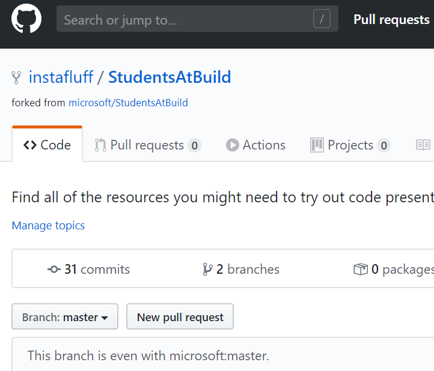

# MSBuildSocialShareboard
Social Shareboard for Microsoft Build 2020 Student Zone!

# Instructions

## Submitting a Note to the Social Shareboard

1. Fork this repository to your GitHub account with the button at the top-right

2. Create a new Markdown file in the `notes` folder inside **Social2020** and name it something unique like **ilovestudentzone2020.md** and fill it out similar to other examples in the notes folder

3. Commit and Push the changes to GitHub

4. Create a Pull Request with your changes by pressing the **New pull request** button on your repository's GitHub page and then pressing **Create pull request**

5. Your note will be added to the **SHAREBOARD.md** file once reviewed and approved by the admins!

## Generating the Social Shareboard

1. Make sure NodeJS is installed. You can download it at [www.nodejs.org](https://www.nodejs.org)

2. Download or Clone this repository to a folder. In a terminal window, you can type `git clone https://github.com/microsoft/StudentsAtBuild.git`

3. Open a Command Prompt/Terminal window to the **Social2020** Shareboard folder and install dependencies: `npm install`

4. Run the project with `node index.js` to scan notes and generate the **shareboard.md** and **index.html** files.

5. Open your web browser to [http://localhost:8000](http://localhost:8000) to view the page.
